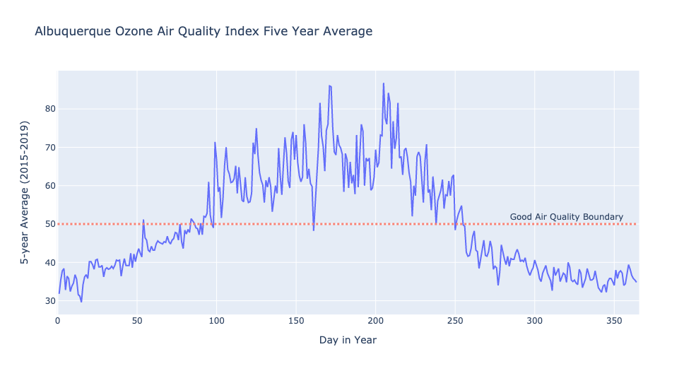
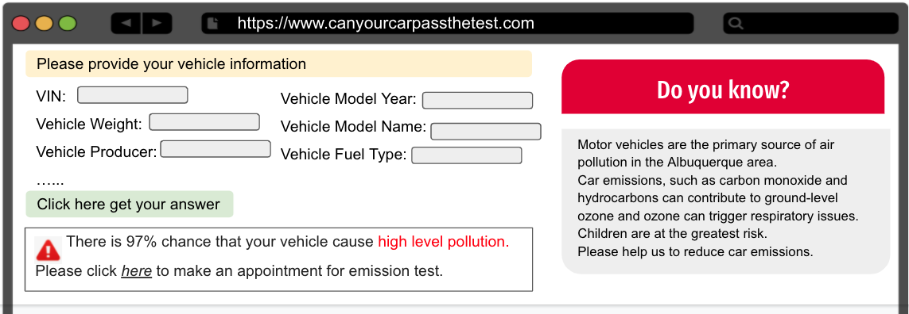
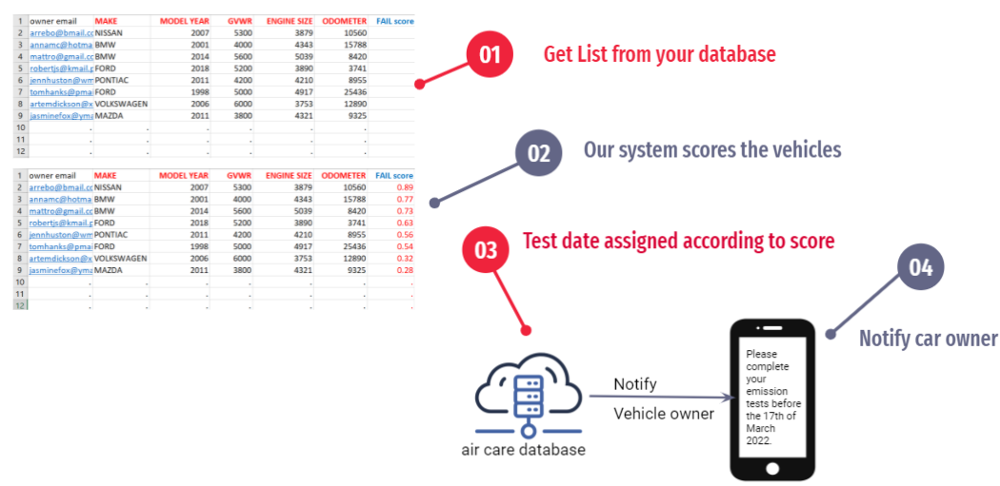
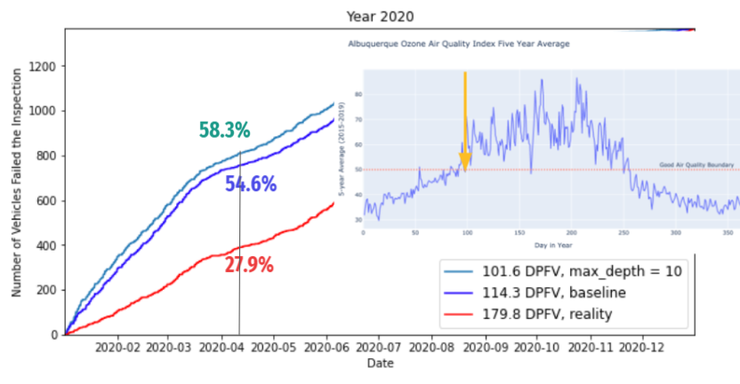

# wimlds_emissions
Open data project at WiMLDS (https://github.com/wimlds/berlin-ds-lab). Reducing air pollution by scheduling early test dates for vehicles that are more likely fail the emissions test. Random Forest algorithm was used to predict how likely a car fail an inspection.

To have an overview of this project, please check out this [notebook](https://github.com/Guli-Y/wimlds_emissions/blob/main/notebooks/summary_guli.ipynb)

To look at the codes, please check out the python files in [emissions](https://github.com/Guli-Y/wimlds_emissions/tree/main/emissions) directory. 
  - data.py: cleaning and feature engineering
  - trainer.py: ML pipeline
  - impsearch.py: custom gridsearch

### Problem - bad air quality in Albuquerque

### Solution 1 
Build a web-app where vehicle owners can check how likely their vehicles fail an emission test by entering vehicle information. The vehicle owner will be directed to make an appointment for emission test if his car has higher chance of failing the test. 

### Solution 2
Get a list of all cars due to be tested in coming year from Albuquerque's air care database and score each vehicle with test-failing probability. Schedule inspection dates for all vehicles on the list based on their scores. 

### Would it work?
With this solution, we could have brought 58% of test-failing vehicles for inspection by day-100 in 2020, which is 30% more than what really happend in 2020. 

# Resources
https://www.cabq.gov/abq-data/
